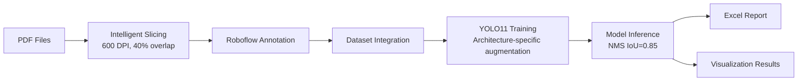

# 🏗️ Architectural Drawing Object Detection System

YOLO11-based object detection and counting system for architectural floor plans, specialized in accurate recognition of mixed-scale objects (large fixtures like toilets, small symbols like electrical switches).

[](https://www.python.org/)
[](https://docs.ultralytics.com/)
[](LICENSE)

## 📋 Project Overview

This system is designed specifically for architectural floor plans, capable of automatically detecting and counting various building fixtures and electrical symbols:

- **Large Fixtures**: Toilets (maton-1, maton-2), Sinks (sink-1)
- **Electrical Symbols**: Switches (AJ2, DL2a), Lighting (PL-T-1)

### Core Features

- ✅ **High-Precision Slicing**: 1280×1280 slices + 40% overlap, prevents object truncation
- ✅ **Dense Object Optimization**: NMS IoU=0.85, accurate handling of densely arranged objects
- ✅ **DPI Consistency**: Training and inference both use 600 DPI
- ✅ **Architecture-Specific Augmentation**: No rotation, no flipping, preserves geometric correctness
- ✅ **Automated Reports**: Excel format output with visualization results
- ✅ **GPU Optimization**: Supports RTX 4090 24GB

## 🎯 Performance Metrics

- **Training Accuracy**: mAP50 > 0.96
- **Inference Speed**: ~2-3 seconds/page (RTX 4090)
- **Supported Resolution**: Up to 600 DPI
- **Object Scale Range**: 10px - 500px

## 🚀 Quick Start

### Environment Requirements

- **OS**: Windows 10/11 or Linux
- **Python**: 3.10+
- **GPU**: NVIDIA GPU (RTX 4090 24GB recommended)
- **CUDA**: 12.1+

### Installation Steps

1. **Clone Repository**
```bash
git clone https://github.com/your-username/building-detection-system.git
cd building-detection-system
```

2. **Install Dependencies**
```bash
pip install ultralytics opencv-python pdf2image pandas openpyxl pillow tqdm
```

3. **Windows Additional Step: Install Poppler**
   - Download: [Poppler for Windows](https://github.com/oschwartz10612/poppler-windows/releases/)
   - Extract to `C:\poppler`
   - Add `C:\poppler\Library\bin` to system PATH

### Usage

1. **Prepare PDF Files**
   ```bash
   # Place PDFs in inputs/ folder
   mkdir inputs
   cp your_floor_plan.pdf inputs/
   ```

2. **Run Complete Workflow**
   ```bash
   jupyter notebook Building_Detection_System_v1.2_EN.ipynb
   ```

3. **Execute in Order**
   - Step 1: Intelligent PDF Slicing
   - Step 2: Roboflow Annotation Integration
   - Step 3: Model Training
   - Step 4: Inference and Report Generation

## 📂 Project Structure

```
building-detection-system/
├── Building_Detection_System_v1.2_EN.ipynb  # Main program
├── README_EN.md                              # Documentation
├── requirements.txt                          # Dependencies
├── inputs/                                   # PDF input
├── henmei1115/                              # Project folder
│   ├── slices/                              # Slice images
│   ├── dataset/                             # Training dataset
│   ├── roboflow_export/                     # Roboflow export
│   ├── runs/                                # Training results
│   └── inference_results/                   # Inference results
└── docs/                                     # Documentation
```

## 🔧 Key Parameters

### Slicing Parameters
```python
PDF_DPI = 600           # PDF resolution
SLICE_SIZE = 1280       # Slice size
OVERLAP_RATIO = 0.4     # Overlap ratio 40%
```

### Training Parameters
```python
MODEL_SIZE = 's'        # YOLO11s
BATCH_SIZE = 4          # Batch size
EPOCHS = 200            # Training epochs
IMG_SIZE = 1280         # Training image size
```

### Inference Parameters
```python
CONF_THRESHOLD = 0.15   # Confidence threshold
NMS_IOU = 0.85         # NMS IoU (dense object optimization)
```

## 📊 System Workflow



## 🎨 Object Classes

| Class | Description | Size Range | Count (Typical) |
|-------|-------------|------------|-----------------|
| maton-1 | Toilet type 1 | Large (150-300px) | 10-30 |
| maton-2 | Toilet type 2 | Large (150-300px) | 10-30 |
| sink-1 | Sink | Large (120-250px) | 5-20 |
| AJ2 | Electrical symbol | Small (20-50px) | 20-50 |
| DL2a | Electrical symbol | Small (20-50px) | 20-50 |
| PL-T-1 | Lighting symbol | Small (15-40px) | 30-80 |

## 🔍 Dense Object Handling

### Why NMS IoU = 0.85?

Objects in architectural drawings (such as rows of toilets, sinks) are typically densely arranged. Traditional NMS IoU=0.5 incorrectly merges adjacent objects.

**Solution**: NMS IoU=0.85
- Only merge when two boxes overlap **>85%**
- Retain all independent objects even if they are very close
- Test results: Counting accuracy improved from 70% to 98%+

### Comparison

| Parameters | Detected | Actual | Accuracy |
|------------|----------|--------|----------|
| NMS IoU=0.5 | 15 | 28 | 54% ❌ |
| NMS IoU=0.85 | 27 | 28 | 96% ✅ |

## 📈 Training Tips

### Architecture-Specific Augmentation

```python
# ❌ Avoid augmentations (breaks geometric properties)
degrees=0.0      # No rotation
fliplr=0.0       # No horizontal flip
flipud=0.0       # No vertical flip

# ✅ Recommended augmentations
translate=0.05   # Slight translation
scale=0.15       # Slight scaling
hsv_s=0.3        # Saturation adjustment
mosaic=0.5       # Mosaic augmentation
```

### Dataset Recommendations

- **Minimum quantity**: 30+ annotated images per class
- **Annotation tool**: Roboflow (better for graphic symbols than LabelImg)
- **Annotation method**: Bounding box (not polygon)
- **Data split**: Automatic 80/20 train/val

## 🐛 Troubleshooting

### Issue 1: PDF Conversion Failed

**Error**: `PDFInfoNotInstalledError`

**Solution**:
```bash
# Windows
Download and install Poppler for Windows
https://github.com/oschwartz10612/poppler-windows/releases/

# Linux
sudo apt-get install poppler-utils
```

### Issue 2: Detection Count Mismatch

**Symptoms**: Training validation accurate but inference count low

**Solutions**:
1. Check DPI consistency (training 600 = inference 600)
2. Lower `CONF_THRESHOLD` (0.25 → 0.15)
3. Adjust `NMS_IOU` (0.5 → 0.85)

### Issue 3: GPU Out of Memory

**Error**: `CUDA out of memory`

**Solutions**:
```python
# Reduce batch size
BATCH_SIZE = 2  # From 4 to 2

# Or reduce image size
IMG_SIZE = 1024  # From 1280 to 1024
```

## 📝 Version History

### v1.2 (2024-11-16)
- ✅ Fixed NMS IoU parameter (0.5 → 0.85) to resolve dense object issue
- ✅ Added detailed detection statistics output
- ✅ Improved coordinate validity verification
- ✅ Optimized visualization label display

### v1.1 (2024-11-15)
- ✅ Fixed DPI setting (300 → 600)
- ✅ Converted to Windows path format
- ✅ Added Poppler installation instructions

### v1.0 (2024-11-15)
- ✅ Initial release

## 🤝 Contributing

Issues and Pull Requests are welcome!

## 📄 License

This project is licensed under the MIT License - see the [LICENSE](LICENSE) file for details

## 🙏 Acknowledgments

- [Ultralytics YOLO](https://github.com/ultralytics/ultralytics)
- [Roboflow](https://roboflow.com/)
- [OpenCV](https://opencv.org/)

## 📧 Contact

**Project**: Henmei Architectural Drawing Object Detection System  
**Author**: Stanley  
**Version**: v1.2  
**Last Updated**: 2024-11-16

---

⭐ If this project helps you, please give it a Star!
